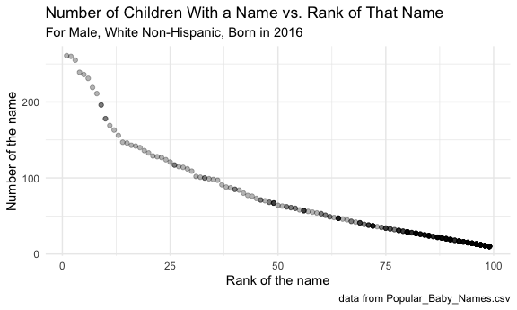

p8105\_hw2\_wq2161
================
Wanxin Qi
10/4/2021

## Problem 1

### Part 1

Read and clean the Mr. Trash Wheel sheet.

``` r
trash_wheel_df = read_excel("data/Trash-Wheel-Collection-Totals-7-2020-2.xlsx", sheet = "Mr. Trash Wheel", range = "A2:N535")

trash_wheel_df =
  trash_wheel_df %>%
  janitor::clean_names() %>%
  drop_na(dumpster) %>%
  mutate(sports_balls = round(sports_balls))

trash_wheel_df
```

    ## # A tibble: 454 × 14
    ##    dumpster month  year date                weight_tons volume_cubic_yards
    ##    <chr>    <chr> <dbl> <dttm>                    <dbl>              <dbl>
    ##  1 1        May    2014 2014-05-16 00:00:00        4.31                 18
    ##  2 2        May    2014 2014-05-16 00:00:00        2.74                 13
    ##  3 3        May    2014 2014-05-16 00:00:00        3.45                 15
    ##  4 4        May    2014 2014-05-17 00:00:00        3.1                  15
    ##  5 5        May    2014 2014-05-17 00:00:00        4.06                 18
    ##  6 6        May    2014 2014-05-20 00:00:00        2.71                 13
    ##  7 7        May    2014 2014-05-21 00:00:00        1.91                  8
    ##  8 8        May    2014 2014-05-28 00:00:00        3.7                  16
    ##  9 9        June   2014 2014-06-05 00:00:00        2.52                 14
    ## 10 10       June   2014 2014-06-11 00:00:00        3.76                 18
    ## # … with 444 more rows, and 8 more variables: plastic_bottles <dbl>,
    ## #   polystyrene <dbl>, cigarette_butts <dbl>, glass_bottles <dbl>,
    ## #   grocery_bags <dbl>, chip_bags <dbl>, sports_balls <dbl>,
    ## #   homes_powered <dbl>

### Part 2

Read and clean precipitation data for 2018 and 2019.

``` r
prcp_2018 = read_excel("data/Trash-Wheel-Collection-Totals-7-2020-2.xlsx", sheet = "2018 Precipitation", range = "A2:B15")

prcp_2018 =
  prcp_2018 %>%
  janitor::clean_names() %>%
  drop_na(month, total) %>%
  mutate(year = "2018") %>%
  relocate(year)

prcp_2019 = read_excel("data/Trash-Wheel-Collection-Totals-7-2020-2.xlsx", sheet = "2019 Precipitation", range = "A2:B15")

prcp_2019 =
  prcp_2019 %>%
  janitor::clean_names() %>%
  drop_na(month, total) %>%
  mutate(year = "2019") %>%
  relocate(year)
```

Combine precipitation datasets and convert month to a character
variable.

``` r
prcp_2018_2019 = 
  bind_rows(prcp_2018, prcp_2019) %>%
  mutate(month = month.name[month])

prcp_2018_2019
```

    ## # A tibble: 24 × 3
    ##    year  month     total
    ##    <chr> <chr>     <dbl>
    ##  1 2018  January    0.94
    ##  2 2018  February   4.8 
    ##  3 2018  March      2.69
    ##  4 2018  April      4.69
    ##  5 2018  May        9.27
    ##  6 2018  June       4.77
    ##  7 2018  July      10.2 
    ##  8 2018  August     6.45
    ##  9 2018  September 10.5 
    ## 10 2018  October    2.12
    ## # … with 14 more rows

### Part 3

The datasets are collected by *Mr. Trash Wheel*. They are under the
background of “a water-wheel vessel that removes trash from the Inner
Harbor in Baltimore, Maryland.” The trash\_wheel\_df dataset contains 14
variables and 454 observations. It includes information on dumpster,
month, year, date, weight\_tons, volume\_cubic\_yards, plastic\_bottles,
polystyrene, cigarette\_butts, glass\_bottles, grocery\_bags,
chip\_bags, sports\_balls, homes\_powered. The prcp\_2018\_2019 dataset
is the combination of the total precipitation amounts by month in 2018
and 2019. The variables are year, month, total. It contains 24
observations. The total precipitation in 2018 was 70.33. The median
number of sports balls in a dumpster in 2019 is 9.

## Problem 2

### Part 1

Read and clean the data in pols-month.csv.

``` r
pols_month_df = read_csv("data/fivethirtyeight_datasets/pols-month.csv")

pols_month_df =
  pols_month_df %>%
  janitor::clean_names() %>%
  mutate(mon = ymd(mon)) %>%
  separate(col = mon, into = c("year", "month", "day"), sep = "-") %>%
  mutate(
    year = as.numeric(year),
    month = as.numeric(month),
    month = month.name[month],
    president = ifelse(prez_dem == "1", "dem", "gop")
  ) %>%
  select(-prez_dem, -prez_gop, -day) %>%
  relocate(year, month, president)

pols_month_df
```

    ## # A tibble: 822 × 9
    ##     year month     president gov_gop sen_gop rep_gop gov_dem sen_dem rep_dem
    ##    <dbl> <chr>     <chr>       <dbl>   <dbl>   <dbl>   <dbl>   <dbl>   <dbl>
    ##  1  1947 January   dem            23      51     253      23      45     198
    ##  2  1947 February  dem            23      51     253      23      45     198
    ##  3  1947 March     dem            23      51     253      23      45     198
    ##  4  1947 April     dem            23      51     253      23      45     198
    ##  5  1947 May       dem            23      51     253      23      45     198
    ##  6  1947 June      dem            23      51     253      23      45     198
    ##  7  1947 July      dem            23      51     253      23      45     198
    ##  8  1947 August    dem            23      51     253      23      45     198
    ##  9  1947 September dem            23      51     253      23      45     198
    ## 10  1947 October   dem            23      51     253      23      45     198
    ## # … with 812 more rows

### Part 2

Read and clean the data in snp.csv.

``` r
snp_df = read_csv("data/fivethirtyeight_datasets/snp.csv")

snp_df =
  snp_df %>%
  janitor::clean_names() %>%
  mutate(date = mdy(date)) %>%
  separate(col = date, into = c("year", "month", "day"), sep = "-") %>%
  mutate(
    year = as.numeric(year),
    year = ifelse(year > 2021, year - 100, year)
  ) %>%
  arrange(year, month) %>%
  mutate(
    month = as.numeric(month),
    month = month.name[month]
  ) %>%
  select(-day) %>%
  relocate(year, month)

snp_df
```

    ## # A tibble: 787 × 3
    ##     year month     close
    ##    <dbl> <chr>     <dbl>
    ##  1  1950 January    17.0
    ##  2  1950 February   17.2
    ##  3  1950 March      17.3
    ##  4  1950 April      18.0
    ##  5  1950 May        18.8
    ##  6  1950 June       17.7
    ##  7  1950 July       17.8
    ##  8  1950 August     18.4
    ##  9  1950 September  19.5
    ## 10  1950 October    19.5
    ## # … with 777 more rows

### Part 3

Tidy the data in unemployment.csv.

``` r
unemployment_df = read_csv("data/fivethirtyeight_datasets/unemployment.csv")

unemployment_df =
  unemployment_df %>%
  janitor::clean_names()

unemployment_tidy =
  unemployment_df %>%
  pivot_longer(
    jan:dec,
    names_to = "month",
    values_to = "percentage"
  ) %>%
  drop_na() %>%
  mutate(
    month = replace(month, month == "jan", "January"),
    month = replace(month, month == "feb", "February"),
    month = replace(month, month == "mar", "March"),
    month = replace(month, month == "apr", "April"),
    month = replace(month, month == "may", "May"),
    month = replace(month, month == "jun", "June"),
    month = replace(month, month == "jul", "July"),
    month = replace(month, month == "aug", "August"),
    month = replace(month, month == "sep", "September"),
    month = replace(month, month == "oct", "October"),
    month = replace(month, month == "nov", "November"),
    month = replace(month, month == "dec", "December")
  ) %>%
  relocate(year, month)

unemployment_tidy
```

    ## # A tibble: 810 × 3
    ##     year month     percentage
    ##    <dbl> <chr>          <dbl>
    ##  1  1948 January          3.4
    ##  2  1948 February         3.8
    ##  3  1948 March            4  
    ##  4  1948 April            3.9
    ##  5  1948 May              3.5
    ##  6  1948 June             3.6
    ##  7  1948 July             3.6
    ##  8  1948 August           3.9
    ##  9  1948 September        3.8
    ## 10  1948 October          3.7
    ## # … with 800 more rows

### Part 4

Join the datasets by merging snp into pols, and merging unemployment
into the result.

``` r
pols_month_date_df =
  pols_month_df %>%
  mutate(with_day = as.Date(paste(month, "01", year, sep = "-"), format = "%b-%d-%Y")) %>%
  mutate(date = format(as.Date(with_day), "%Y-%m")) %>%
  select(-with_day) %>%
  relocate(date)

snp_date_df =
  snp_df %>%
  mutate(with_day = as.Date(paste(month, "01", year, sep = "-"), format = "%b-%d-%Y")) %>%
  mutate(date = format(as.Date(with_day), "%Y-%m")) %>%
  select(-with_day) %>%
  relocate(date)

unemployment_date_tidy =
  unemployment_tidy %>%
  mutate(with_day = as.Date(paste(month, "01", year, sep = "-"), format = "%b-%d-%Y")) %>%
  mutate(date = format(as.Date(with_day), "%Y-%m")) %>%
  select(-with_day) %>%
  relocate(date)

pols_snp_df =
  left_join(pols_month_date_df, snp_date_df, by = c("date" = "date")) %>%
  select(-year.x, -month.x, -year.y, -month.y)

pols_snp_unemployment_df =
  left_join(pols_snp_df, unemployment_date_tidy, by = c("date" = "date")) %>%
  select(-year, -month)

pols_snp_unemployment_df
```

    ## # A tibble: 822 × 10
    ##    date    president gov_gop sen_gop rep_gop gov_dem sen_dem rep_dem close
    ##    <chr>   <chr>       <dbl>   <dbl>   <dbl>   <dbl>   <dbl>   <dbl> <dbl>
    ##  1 1947-01 dem            23      51     253      23      45     198    NA
    ##  2 1947-02 dem            23      51     253      23      45     198    NA
    ##  3 1947-03 dem            23      51     253      23      45     198    NA
    ##  4 1947-04 dem            23      51     253      23      45     198    NA
    ##  5 1947-05 dem            23      51     253      23      45     198    NA
    ##  6 1947-06 dem            23      51     253      23      45     198    NA
    ##  7 1947-07 dem            23      51     253      23      45     198    NA
    ##  8 1947-08 dem            23      51     253      23      45     198    NA
    ##  9 1947-09 dem            23      51     253      23      45     198    NA
    ## 10 1947-10 dem            23      51     253      23      45     198    NA
    ## # … with 812 more rows, and 1 more variable: percentage <dbl>

### Part 5

The pols-month dataset contains 9 variables and 822 observations related
to the number of national politicians who are democratic or republican
at any given time. The range of years starts from 1947 to 2015. It
includes information of year, month, president, gov\_gop, sen\_gop,
rep\_gop, gov\_dem, sen\_dem, rep\_dem.

The snp dataset contains 3 variables and 787 observations related to
Standard & Poor’s stock market index (S&P), often used as a
representative measure of stock market as a whole. The range of years
starts from 1950 to 2015. It includes information of year, month, close.

The unemployment dataset contains 3 variables and 810 observations
related to percentage of unemployment. The range of years starts from
1948 to 2015. It includes information of year, month, percentage.

The pols\_snp\_unemployment dataset is a combination of the three
datasets, which contains 10 variables and 822 observations. The range of
years starts from 1947 to 2015. It includes information of date,
president, gov\_gop, sen\_gop, rep\_gop, gov\_dem, sen\_dem, rep\_dem,
close, percentage.

## Problem 3

### Part 1

Load and tidy the data.

``` r
pop_baby_names_df = read_csv("data/Popular_Baby_Names.csv")

pop_baby_names_df =
  pop_baby_names_df %>%
  janitor::clean_names() %>%
  mutate(
    gender = toupper(gender),
    ethnicity = toupper(ethnicity),
    childs_first_name = toupper(childs_first_name),
    ethnicity = recode(ethnicity,
           "ASIAN AND PACI" = "ASIAN AND PACIFIC ISLANDER",
           "BLACK NON HISP" = "BLACK NON HISPANIC",
           "WHITE NON HISP" = "WHITE NON HISPANIC"
           )
  ) %>%
  distinct()

pop_baby_names_df
```

    ## # A tibble: 12,181 × 6
    ##    year_of_birth gender ethnicity                  childs_first_name count  rank
    ##            <dbl> <chr>  <chr>                      <chr>             <dbl> <dbl>
    ##  1          2016 FEMALE ASIAN AND PACIFIC ISLANDER OLIVIA              172     1
    ##  2          2016 FEMALE ASIAN AND PACIFIC ISLANDER CHLOE               112     2
    ##  3          2016 FEMALE ASIAN AND PACIFIC ISLANDER SOPHIA              104     3
    ##  4          2016 FEMALE ASIAN AND PACIFIC ISLANDER EMILY                99     4
    ##  5          2016 FEMALE ASIAN AND PACIFIC ISLANDER EMMA                 99     4
    ##  6          2016 FEMALE ASIAN AND PACIFIC ISLANDER MIA                  79     5
    ##  7          2016 FEMALE ASIAN AND PACIFIC ISLANDER CHARLOTTE            59     6
    ##  8          2016 FEMALE ASIAN AND PACIFIC ISLANDER SARAH                57     7
    ##  9          2016 FEMALE ASIAN AND PACIFIC ISLANDER ISABELLA             56     8
    ## 10          2016 FEMALE ASIAN AND PACIFIC ISLANDER HANNAH               56     8
    ## # … with 12,171 more rows

### Part 2

Produce a table showing the rank in popularity of the name “Olivia” as a
female baby name over time.

``` r
olivia_df =
  pop_baby_names_df %>%
  filter(childs_first_name == "OLIVIA", gender == "FEMALE") %>%
  select(-count) %>%
  pivot_wider(
    names_from = "year_of_birth",
    values_from = "rank"
  )

knitr::kable(olivia_df)
```

| gender | ethnicity                  | childs\_first\_name | 2016 | 2015 | 2014 | 2013 | 2012 | 2011 |
|:-------|:---------------------------|:--------------------|-----:|-----:|-----:|-----:|-----:|-----:|
| FEMALE | ASIAN AND PACIFIC ISLANDER | OLIVIA              |    1 |    1 |    1 |    3 |    3 |    4 |
| FEMALE | BLACK NON HISPANIC         | OLIVIA              |    8 |    4 |    8 |    6 |    8 |   10 |
| FEMALE | HISPANIC                   | OLIVIA              |   13 |   16 |   16 |   22 |   22 |   18 |
| FEMALE | WHITE NON HISPANIC         | OLIVIA              |    1 |    1 |    1 |    1 |    4 |    2 |

Produce a similar table showing the most popular name among male
children over time.

``` r
male_pop_df =
  pop_baby_names_df %>%
  filter(gender == "MALE", rank == 1) %>%
  select(-count, -rank) %>%
  pivot_wider(
    names_from = "year_of_birth",
    values_from = "childs_first_name"
  )

knitr::kable(male_pop_df)
```

| gender | ethnicity                  | 2016   | 2015   | 2014   | 2013   | 2012   | 2011    |
|:-------|:---------------------------|:-------|:-------|:-------|:-------|:-------|:--------|
| MALE   | ASIAN AND PACIFIC ISLANDER | ETHAN  | JAYDEN | JAYDEN | JAYDEN | RYAN   | ETHAN   |
| MALE   | BLACK NON HISPANIC         | NOAH   | NOAH   | ETHAN  | ETHAN  | JAYDEN | JAYDEN  |
| MALE   | HISPANIC                   | LIAM   | LIAM   | LIAM   | JAYDEN | JAYDEN | JAYDEN  |
| MALE   | WHITE NON HISPANIC         | JOSEPH | DAVID  | JOSEPH | DAVID  | JOSEPH | MICHAEL |

### Part 3

For male, white non-hispanic children born in 2016, produce a scatter
plot showing the number of children with a name (y axis) against the
rank in popularity of that name (x axis).

``` r
count_rank_df =
  pop_baby_names_df %>%
  filter(gender == "MALE", ethnicity == "WHITE NON HISPANIC", year_of_birth == 2016)

count_rank_plot =
  count_rank_df %>%
  ggplot(aes(x = rank, y = count)) +
  geom_point(alpha = 0.3) +
  labs(
    title = "Number of Children With a Name vs. Rank of That Name",
    subtitle = "For Male, White Non-Hispanic, Born in 2016",
    x = "Rank of the name",
    y = "Number of the name",
    caption = "data from Popular_Baby_Names.csv"
  ) +
  theme_minimal()

count_rank_plot
```


